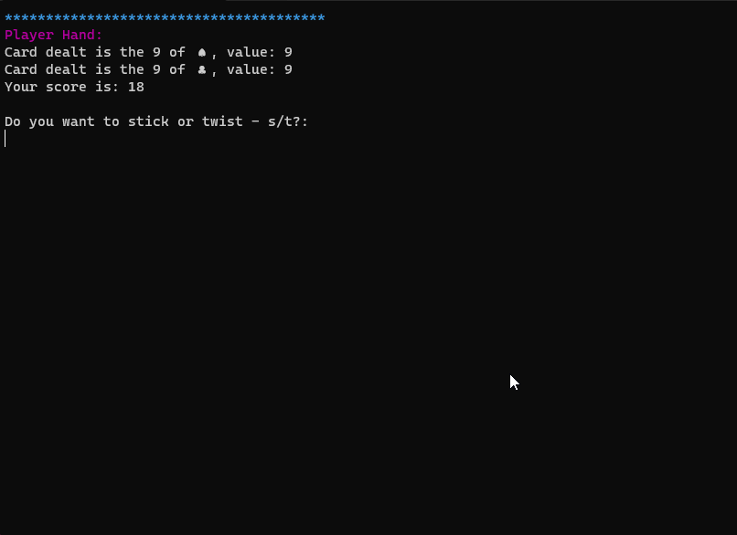

# Blackjack made in a Console Application

A simple Blackjack game created using C# in .NET Framework

This game follows the basic rules of the Blackjack card game. 

It is a one player game (player vs. dealer). The dealer deals the cards and the player decides whether they want to stick(s) or twist(t).

The aim of the game is to make up a hand value of 21, if you go over this you automatically lose. Whichever player's hand value is closest to 21, not exceeding 21, wins the game.

Basic C# was used to create this console app, such as (loops, if statements and inheritance).